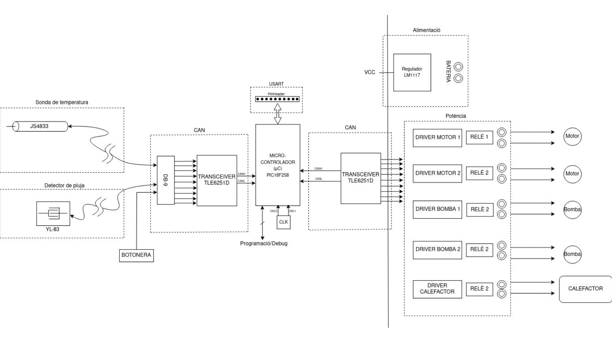
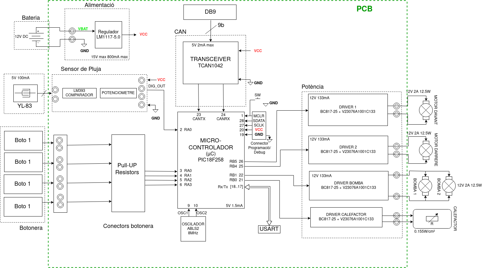

# Projecte Eines De Disseny  
## Sistema de Neteja-Parabrises D'Un Automòbil  
###### David Miravent, Biel Hornas, Aidar Iglesias  

### Objectiu  
Aquest projecte té com a objectiu dissenyar el l'entorn electrònic que conforma el sistema de neteja-parabrises d'un automòbil.  
El projecte estarà dividit en 7 parts:  

1. Diagrama de blocs i components
2. Esquemàtic i simulacions
3. Placement i routing (layout v1)
4. Pre-entega (layout v2)
5. Entrega final (layout v3)
6. Muntatge i soldadura
7. Test PCB  

----  

### Característiques i epecificacions  
El sistema de neteja-parabrises té com a característica principal, com ja diu el seu nom, netejar la lluna del parabrises. En el nostre cas, estarà dissenyat per tal de netejar tant la lluna davantera, com la del darrere. Com que aquest sistema serà part d'un conjunt de ECUs (Electronic Control Unit) d'un automòbil, hi ha un sèrie d'elements que tots ells tindran en comú:  

* Una etapa de regulació de tensió (es farà servir [LM1117-5.0])
* Un microcontrolador (es farà servir un [PIC18F2580] de 28 pins) encarregat del control del nostre mòdul i de la comunicació amb els altres
* Un bus de programació i debug del microcontrolador
* Un bus [CAN] que permet la comunicació síncrona amb els altres mòduls
* Un bus [I2C] (o bé [SPI]) per a la comunicació síncrona interna del nostre mòdul
* Un bus de comunicació [USART] que permet monitoritzar el sistema des d'un ordinador extern
* Una botonera per permetre la interacció entre l'usuari i el mòdul

El sistema ha de complir les següents **especificacions**:  

* Dos motors amb el seu final de carrera
* Dues bombes de líquid neteja-parabrises
* Sensor digital de pluja
* Calefactor del vidre

----  

### Funcionament  

El sistema al complet estarà controlat per el microcontrolador. Per al moviment dels neteja parabrises, es faran servir dos motors, un per davant i un per darrere. Aquests motors estaran controlats per uns drivers i un H-Bridge. Quan l'usuari desitgi o quan el sensor de pluja detecti pluja, el microcontrolador enviarà el senyal d'activació dels motors. També s'inclourà un sistema de final de carrera, dissenyat a partir d'un sensor de corrent, que evitarà la sobrecàrrega als motors i indicarà el canvi de sentit del gir.  

El sistema també inclou dues bombes de líquid neteja-parabrises, cadascuna d'elles controlada per un driver i un relé. Aquestes s'activaran quan el conductor ho desitgi i funcionaran de la mateixa manera que el neteja-parabrises: mitjançant un motor.  

Hi haurà un mode de neteja automàtic, accionat per un sensor digital de pluja. Quan es detecti pluja, el neteja-parabrises es posarà en funcionament a velocitat 1.  

Hi ha (tres)? modes d'operació:
* Velocitat 1 (Velocitat per defecte)
* Velocitat 2 (Velocitat més alta)
* Automàtic 3 (El sensor de pluja activa el neteja-parabrises i el fa funcionar a velocitat 1 per defecte)  

A part d'aquest 3 modes de funcionament, si així ho desitja, l'usuari pot activar les bombes de líquid manualment. Addicionalment, pot fer que les escombretes fagin una sola passada, també amb activació manual.  

----  

#### Diagrama de Blocs  

  
**Figura 1.** Versió 1 del diagrama de blocs - 24.03.2023.  

  
**Figura 2.** Versió 2 del diagrama de blocs - 30.03.2023.

----  

#### Components  

| Ref. | Descripció | Datasheet |  
| ---- | ---------- | --------- |  
| PIC18F2580 | 28-Pin High Performance, Enhanced FLASH Microcontroller with CAN. S'encarrega del control integral del sistema. | [PIC18F2580] |  
| TCAN1042 | TCAN1042 Fault Protected CAN Transceiver with CAN FD. L'utilitzarem per a la comunicació entre mòduls independents. | [TCAN1042] |  
| LM1117-5.0 | LM1117 800-mA, Low-Dropout Linear Regulator. Si bé hi han diversos models de la mateixa família, farem servir el que dona una tensió de sortida de 5V fixos. | [LM1117-5.0] |  
| ABLS2-8.000MHZ-D4Y-T | Low Profile Surface Mount Microprocessor Crystal. L'usarem com a font de senyal síncron de referència per al microcontrolador. És de 8MHz. | [ABLS2-8MHZ]  
| V23076A1001C133 | Automotive, PCB Single Power Relay K (Sealed) with wide voltage range and limiting continuous current 45A. Utilitzarem aquest relé per a les aplicacions de potència, com ara la commutació dels motors, de les bombes i del calefactor. | [V23076A1001C133]  
| BC817-25 | NPN general purpose transistor used for switching and amplification. Features high current (max. 500 mA) and low voltage (max. 45 V). Transistor bipolar NPN que farem servir per a amplificar el corrent de commutació dels relés. | [BC817-25] |  
| YL-83 | Rain and snow are quickly and accurately detected with the YL-83 Rain Detector. L'implementarem de manera que quan detecti pluja, els neteja-parabrises s'accionin automàticament. | [YL-83] |  
| LM393 | Comparator with lower offset voltage, higher supply voltage capability, lower supply current, lower input bias current, lower propagation delay, and improved 2 kV ESD performance and input ruggedness through dedicated ESD clamps. Comparador que farem servir a l'hora de detectar si plou o no. | [LM393] |  
| 3362-¼” Square Trimpot | Trimming Potentiometer. Withstands harsh environments and immersion cleaning processes. Potenciòmetre que usarem per adjustar el llindar del sensor de pluja. | [3362-¼” Square Trimpot]  
| Flexible Heaters 78000 Series | Truly transparent, no wires in clear view area, optical grade, thin-film polyester, low power consumption for use with battery or line power. Tires conductores que tenen com a objectiu escalfar la lluna del darrere de l'automòbil. | [Flexible Heaters 78000 Series] |  
| WLD4383 | Motor reductor _sinfín_ 12VDC, corrent nominal de 2A, velocitat nominal de 44rmp i una potència de 12.5W. | [WLD4383]  
| EHDB9MF | Connector DB-9 de entrada-sortida de la comunicació CAN. | [EHDB9MF] |  

----
#### Historial de canvis  

| Data | Autor | Descripció |  
| ---- | ----- | ---------- |  
| ... | ... | ... |  

[LM1117-5.0]:(https://pdf1.alldatasheet.com/datasheet-pdf/view/1283792/ONSEMI/LM1117.html)
[PIC18F2580]:(https://www.google.com/url?sa=t&rct=j&q=&esrc=s&source=web&cd=&cad=rja&uact=8&ved=2ahUKEwjDqqnf-fv9AhWAXaQEHbvXCRAQFnoECBAQAQ&url=http%3A%2F%2Fww1.microchip.com%2Fdownloads%2Fen%2Fdevicedoc%2F39637d.pdf&usg=AOvVaw2IUnS-oBxKa8P9iGtzo3Zw)
[CAN]:(https://www.google.com/url?sa=t&rct=j&q=&esrc=s&source=web&cd=&cad=rja&uact=8&ved=2ahUKEwiok8Se-vv9AhVSUKQEHZ1pCZgQFnoECAwQAQ&url=https%3A%2F%2Fwww.ti.com%2Flit%2Fpdf%2Fsloa101&usg=AOvVaw2UOzkNpIhXCxiMwoktDuf0)  
[I2C]:(https://www.google.com/url?sa=t&rct=j&q=&esrc=s&source=web&cd=&cad=rja&uact=8&ved=2ahUKEwjWtri9-vv9AhV0UKQEHW7hC54QFnoECA4QAw&url=https%3A%2F%2Flearn.sparkfun.com%2Ftutorials%2Fi2c%2Fall&usg=AOvVaw2qpJdC-UXOjJ03YiNE41H4)
[SPI]:(https://www.google.com/url?sa=t&rct=j&q=&esrc=s&source=web&cd=&cad=rja&uact=8&ved=2ahUKEwjrloTV-vv9AhUyU6QEHYIMDGgQFnoECAwQAQ&url=https%3A%2F%2Flearn.sparkfun.com%2Ftutorials%2Fserial-peripheral-interface-spi%2Fall&usg=AOvVaw13lzzbG5R14CmXp8TmZ-Gi)
[USART]:(https://www.google.com/url?sa=t&rct=j&q=&esrc=s&source=web&cd=&cad=rja&uact=8&ved=2ahUKEwiqn8Pz-vv9AhWSSKQEHeZICZEQFnoECCwQAQ&url=https%3A%2F%2Fwww.ti.com%2Fsc%2Fdocs%2Fproducts%2Fmicro%2Fmsp430%2Fuserguid%2Fag_12.pdf&usg=AOvVaw08SU_ut2QHKfywglni0Si5)
[TCAN1042]:(https://www.ti.com/lit/ds/symlink/tcan1042hv.pdf?ts=1679998738764&ref_url=https%253A%252F%252Fwww.ti.com%252Fproduct%252FTCAN1042HV%253Futm_source%253Dgoogle%2526utm_medium%253Dcpc%2526utm_campaign%253Dti-null-null-xref-cpc-pf-google-wwe%2526utm_content%253Dxref%2526ds_k%253D%257B_dssearchterm%257D%2526DCM%253Dyes%2526gclid%253DCjwKCAjwoIqhBhAGEiwArXT7K-KRBrhZ83RLTsUGoJig2M_4bRYp_h0gqncf8DgUPU1i8GLFYlaWCBoCYGYQAvD_BwE%2526gclsrc%253Daw.ds)  
[ABLS2-8MHZ]:(https://www.mouser.es/datasheet/2/3/ABLS2-1775116.pdf)  
[V23076A1001C133]:(https://www.farnell.com/datasheets/2243264.pdf)  
[BC817-25]:(https://pdf1.alldatasheet.com/datasheet-pdf/view/16111/PHILIPS/BC817-25.html)  
[YL-83]:(https://urolakostapk.files.wordpress.com/2016/10yl-83-rain-detector-datasheet_low.pdf)  

[LM393]:(https://www.ti.com/lit/ds/symlink/lm393.pdf?ts=1680064194729&ref_url=https%253A%252F%252Fwww.ti.com%252Fproduct%252FLM393)  
[3362-¼” Square Trimpot]:(https://www.farnell.com/datasheets/3171216.pdf)  
[Flexible Heaters 78000 Series]:(https://www.mouser.es/datasheet/2/187/honeywell-sensing-flexible-heaters-line-guide-0090-1525721.pdf)  
[WLD4383]:(https://transmotec.es/product/WLD4383-12-61/)  
[EHDB9MF]:(https://www.switchcraft.com/assets/1/24/EHDB9_EHHD15_SERIES_CD.PDF?4882)  
